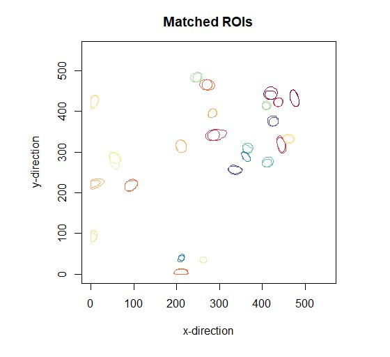
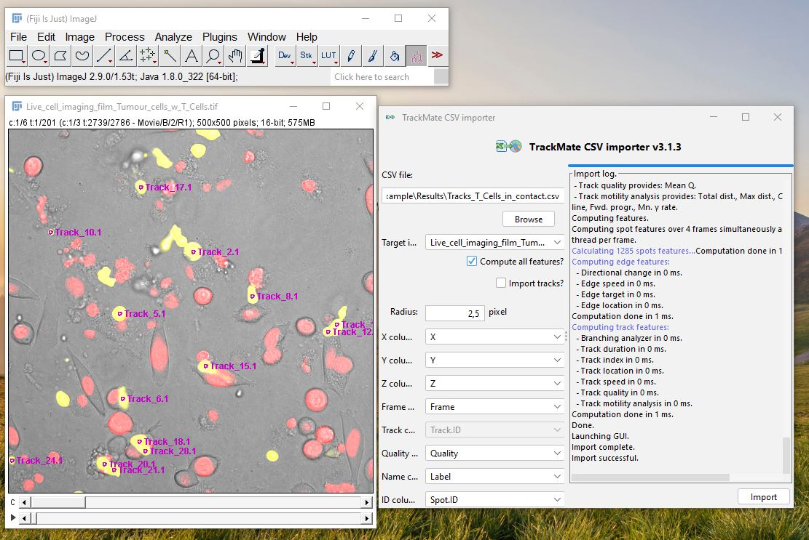

```{r setup, include=FALSE}
knitr::opts_chunk$set(echo = TRUE)

required <- c("cellt rackR", "dplyr", "ggplot2", "RImageJROI", "spatstat", "sp", "sf","r2r","future", "RColorBrewer", "viridis", "tidyverse")
lapply( required, require, character.only = TRUE)

devtools::document()

```

--------------------------------------------------------------------------------

# __About__

--------------------------------------------------------------------------------

This R package was written to process imaging files acquired from live-cell imaging of T cells and tumour cells. It requires the prior analysis of the live-cell imaging sequences with a cell tracking tool, e.g., [TrackMate](https://imagej.net/plugins/trackmate/) or [Imaris](https://imaris.oxinst.com/products/imaris-for-tracking). It offers functions to compute cell-cell distances, cell-cell contacts, and characteristics of cell-cell interaction. Moreover, it allows to connect the results to immunohistochemical staining results.
 
--------------------------------------------------------------------------------

# __Goal of the project__

--------------------------------------------------------------------------------

The goal of this R package is to enable the quantitative analysis of T cell-tumour cell interaction in live cell imaging sequences


# __System Requirements__

--------------------------------------------------------------------------------

The R package was built with the R version 4.3.1 and is suitable for all operating systems running R (version 4.3.1 or later) with sufficient RAM to load all data sets. 
The R package requires the R packages future (Version 1.33.1), RImageJROI (Version 0.1.2),  r2r (Version 0.1.1),sf (Version 1.0-15), spatstat (Version 3.0-7), sp (Version 2.1-3), tidyverse (Version2.0.0) and ggplot (Version 3.5.0). The dependencies are stored in the RProfile.

The package was tested on a Windows 10 Pro Education operating system (Version 22H2) with a 13th Gen Intel(R) Core (TM) i9-13900KF 3.00 GHz processor and 192 GB RAM.

# __Installation__ 

--------------------------------------------------------------------------------

The latest development version of cellcontacts can be installed from GitHub:

```{r, eval = FALSE}
devtools::install_github( "juliaquach02/cellcontacts" )
```
The package can be loaded via:

```{r cellcontacts}
library( cellcontacts )
```

--------------------------------------------------------------------------------

# __Work flow__

--------------------------------------------------------------------------------

The package was built to analyze 2D live-cell imaging movies. Before using the package,
the cells need to segmented and tracked, for example using the Fiji plugin 
[TrackMate](https://imagej.net/plugins/trackmate/) by Tinevez at al [@RN293]. 

The cellcontacts package processes 

* ROIs representing segmented cells which are saved as .roi-files in a zipped folder, and 
* cell tracks which are saved as .csv file with the columns "Label", "X", "Y", "Frame".


### __Preprocessing__

For the segmentation and tracking of the cells in the live-cell imaging film, TrackMate proves to be a useful tool. It is a modular tool that enables the segmentation and tracking of cells via common segmentation tools, e.g. [StarDist](https://imagej.net/plugins/stardist), 
and tracking tools, e.g. the [LAP tracker](https://www.nature.com/articles/nmeth.1237). 

The cellcontacts package requires the segmentation and tracking of tumour and T cells as two separate cell populations. Cell areas, called cell ROIs (region of interest), should be named by their track name with index in the format *Track_[id]_[index]* and saved as .roi-files in a zipped folder. In addition, cell tracks should be saved as .csv file.

To ensure correct import of the data in RStudio, please make sure that file names do not contain a "\." and that only the first line of the .csv file contain column headers.

### __Setting directories and loading the data__

After setting source and destination directories, we can load the data into RStudio. To import the cell tracks, we simply use the `read.table()` function. To import the cell ROIs, we use the `read.ijzip()` function from the [RImageJROI](https://cran.r-project.org/web/packages/RImageJROI/index.html) package. 

As the number of ROIs might be very large, it might be necessary to split the zipped ROIs into multiple zipped subfolders and load the folders in parallel using the [future](https://cran.r-project.org/web/packages/future/index.html) package. To save the ROIs into separate subfolders, an ImageJ macro is provided [here](ImageJ_Macros/Macro_Rename_and_Save_ROIs_in_Subfolders.ijm).

Below, the code to load the tumour cell tracks and tumour cell ROIs is displayed. Analogously, we can load the T cell tracks and T cell ROIs.

```{r directories, include=FALSE}
# Setting directories ----------------------------------------------------------
# Source directory to ROIs 
tumourROIsPath <- paste0(getwd(), "/Example/Tumour_Cells/RoiSet_Tumour_Cells/")
tcellROIsPath <- paste0(getwd(), "/Example/T_Cells/RoiSet_T_Cells/")
endPointROIPath <- paste0(getwd(),"/Example/Endpoint_Measurement/RoiSet_Endpoint_DAPI.zip")

# Source directory to tracks and track information
tumourTracksPath <-  paste0(getwd(),"/Example/Tumour_Cells/Tracks_Tumour_Cells.csv")
tcellTracksPath <-  paste0(getwd(), "/Example/T_Cells/Tracks_T_Cells.csv")

# Source directory to endpoint measurement of signal intensity
endPointMeasPath <- paste0(getwd(), "/Example/Endpoint_Measurement/Results_Endpoint_Intensity_p21.csv")

# Destination directory for plots and exported data frames
resultsPath <- paste0(getwd(), "/Example/Results/")
```

```{r import tumour cells}
# Importing tracks
tumourTracksTxt <- read.table( tumourTracksPath, header = TRUE, sep = ",", )

# Load tumour ROIs of movie
# Create list of zipped ROI folders (Adjust numSubfolders for each data set)
numTumourSubfolders <- 14 
pathROIs <- list()

for( i in 1:numTumourSubfolders){
  pathROIs[[i]] <- paste0(tumourROIsPath, as.character(i-1), ".zip")
}

# Subdivide list into two lists to create two jobs
pathROIsPt1 <- pathROIs[ 1:floor(numTumourSubfolders/2) ]
pathROIsPt2 <- pathROIs[ (floor(numTumourSubfolders/2) + 1):numTumourSubfolders ]

# Load ROIs in parallel
plan(multisession)

ROIsPt1 %<-% {  # job 1
  ROIsPt1 <- lapply( pathROIsPt1, read.ijzip)
}
ROIsPt2 %<-%{ # job 2
  ROIsPt2 <- lapply( pathROIsPt2, read.ijzip) 
}

tumourROIs <- append( ROIsPt1, ROIsPt2)


# Load endpoint data ----------------------------------------------------

endPointROIs <- read.ijzip( endPointROIPath )
endPointMeasTxt <- read.table( endPointMeasPath, header = TRUE, sep = ",", )

```


```{r import T cells, include = FALSE}
# Importing tracks ----------------------------------------------------
# Load track information as txt
tcellTracksTxt <- read.table( tcellTracksPath, header = TRUE, sep = ",",)

# Load T cell ROIs of movie -----------------------------------------------------------

# Create list of zipped ROI folders
numTcellSubfolders <- 2 #### Set numSubfolders for each data set
pathROIs <- list()

for( i in 1:numTcellSubfolders){
  pathROIs[[i]] <- paste0(tcellROIsPath, as.character(i-1), ".zip")
}

# Subdivide list into two lists to create two jobs
pathROIsPt1 <- pathROIs[ 1:floor(numTcellSubfolders/2) ]
pathROIsPt2 <- pathROIs[ (floor(numTcellSubfolders/2) + 1):numTcellSubfolders ]


# Load ROIs in parallel

plan(multisession)

# job 1
ROIsPt1 %<-% {
  ROIsPt1 <- lapply( pathROIsPt1, read.ijzip)
}

# job 2
ROIsPt2  %<-% {
  ROIsPt2 <- lapply( pathROIsPt2, read.ijzip)
}

tcellROIs <- append(ROIsPt1, ROIsPt2)


rm(ROIsPt1, ROIsPt2) # Clear memory

```
### __Analysis__

To process a large set of segmented cells, we need to put the data into a suitable data structure to allow easy and efficient computation and access.

### 1. Matching track names to their frame number

Using the function `matchTrackNamesWithFrameNum()`, we assign the cell ROIs to their corresponding frame number.

```{r matching track names to frame number}

tumour_trackName_frameNum <- matchTrackNamesWithFrameNum( tumourTracksTxt )
tcell_trackName_frameNum <- matchTrackNamesWithFrameNum( tcellTracksTxt )

print( head( tumour_trackName_frameNum ))
print( head( tcell_trackName_frameNum ))

```

### 2. Putting data into hash maps

To efficiently access our data during computation, we arrange our data set into hash maps. Furthermore, we sort the cell ROIs into a 2D grid with a column and row width of 100 &micro;m to get rough estimates of their position. 

To create a 2D grid, we provide the function `create_grid()`. To put the data into hash maps, we provide the functions

* `insert_Hashmap_FrameNumToNames()` to retrieve track names of all cells for a specific time point.
* `insert_Hashmap_NamesToCenter()` to retrieve the center point for a specific ROI name.
* `insert_Hashmap_NamesToGrid()` to retrieve a rough position in the frame for a specific ROI name.
* `insert_Hashmap_NamesToCoords()` to retrieve the ROI coordinates for a specific ROI name

```{r hash maps}

# Hash map from names to coordinates
tumourROImap <- hashmap( default = "No value for this key")
invisible( lapply( tumourROIs, insert_Hashmap_NamesToCoords, ROImap = tumourROImap) )

tcellROImap <- hashmap( default = "No value for this key")
invisible(  lapply( tcellROIs, insert_Hashmap_NamesToCoords, ROImap = tcellROImap)  )

# Hash map from time points to names
insert_Hashmap_FrameNumToNames( tumour_trackName_frameNum, ROImap = tumourROImap )
insert_Hashmap_FrameNumToNames( tcell_trackName_frameNum, ROImap = tcellROImap )

# Hash map from names to center points
tumourROImap_center <- hashmap( default = "No value for this key")
tcellROImap_center <- hashmap( default = "No value for this key")

invisible( lapply( tumourROIs, insert_Hashmap_NamesToCenter, ROImap = tumourROImap_center ) )
invisible( lapply( tcellROIs, insert_Hashmap_NamesToCenter, ROImap = tcellROImap_center ) )

# Hash map from names to position in grid
grid <- create_grid( c(0,600), c(0,600), dim = 6) ### Frame dimensions should be checked for each data set

tumourROImap_NamesToGrid <- hashmap( default = "No value for this key")
tcellROImap_NamesToGrid <- hashmap( default = "No value for this key")

invisible( lapply( tumourROIs, insert_Hashmap_NamesToGrid, ROImap = tumourROImap_NamesToGrid, grid = grid ) )
invisible( lapply( tcellROIs, insert_Hashmap_NamesToGrid, ROImap = tcellROImap_NamesToGrid, grid = grid ) )

# Add endPointROIs into field and hash map
endpointROImap <- hashmap( default = "No value for this key")
insert_Hashmap_NamesToCoords( endPointROIs, endpointROImap)
insert_Hashmap_NamesToGrid( endPointROIs, ROImap = tumourROImap_NamesToGrid, grid = grid  )

```

```{r hashmap additional code, include = FALSE}
# Add last time point to both hash maps
lastTimepoint <- max( as.integer( tumour_trackName_frameNum$Frame ), as.integer( tcell_trackName_frameNum$Frame ) )

tumourROImap[["lastTimepoint"]] <- lastTimepoint
tcellROImap[["lastTimepoint"]] <- lastTimepoint

# Delete loaded zip folders to clear memory 
rm( tumourROIs )
rm( tcellROIs )
gc()

```


### 3. Mapping tracks to endpoint staining

We often want to connect the dynamic information of the cell tracks to the static information of the same cells from immunological staining.
For this, we provide the function `match_to_endpoint_ROIs()` to match the cell tracks to the corresponding cell ROIs at the end point. The function `add_meas_to_matches()` can add the measurements of the signal intensity to the mapping of cell tracks to endpoint ROIs.

```{r mapping to endpoint}

# Map tumour tracks from movie to endpoint staining
matches <- match_to_endpoint_ROIs(  endPointROIs, endpointROImap, tumourROImap, tumourROImap_center, tumourROImap_NamesToGrid )

# Add measurement results to matches
result <- add_meas_to_matches( matches, endPointMeasTxt )
print( head( result ) )

```

To check the mapping, we can plot the matched endpoint ROIs and cell tracks by their color in one plot:

<center>
{#id .class width=56% height=51.2%}*Cell areas at last time point are mapped to the cell areas from the immunological staining at the endpoint. Matched cells are plotted in the same color.*
</center>


### 4. Computing cell-cell distances

Cell-cell distances need to be computed to filter for cell-cell contacts. For this, we provide the function `compute_distTimepoint_wGrid()`. 

This function computes for a given time point all possible tumour cell/T cell pairs. For each pair, the function checks the rough position of both cells using their position in the 2D grid. If the cells are at least in neighboring columns and rows of the grid, the euclidean distance between the cell ROI is computed. 

The output of the function is a data frame which lists all possible cell pairs and either the distance of the pair or a remark that the distance is substantially larger than the distance threshold for a cell-cell contact.

```{r cell-cell distances}
cellDist <- lapply( 0: tumourROImap[["lastTimepoint"]], compute_distTimepoint_wGrid,
                              gridWidth = 100,
                              ROImap1 = tumourROImap,
                              ROImap2 = tcellROImap,
                              ROImapField1 = tumourROImap_NamesToGrid,
                              ROImapField2 = tcellROImap_NamesToGrid )

print( head(cellDist[[1]]) )

```


### 5. Filtering for cell-cell contacts

To filter the cell pairs for cell-cell contacts, we only keep cell pairs that maintain a distance below a distance threshold for a minimum duration of frames. The distance and duration threshold can be set manually. 

As result, we obtain a list of tumour cell/T cell pairs and each list entry represents one pair and contains the columns "time point" and "distances".

```{r cell-cell contacts}

# Set a thresholds for the minimum duration and distance of a contact
minDuration <- 3
distThresh <- 1

# Filter for cell-cell contacts using pipes from the tidyverse package
pairs <-  cellDist %>% 
    add_columnPair() %>% 
    lapply( add_columnTimepoint, tumour_trackName_frameNum = tumour_trackName_frameNum) %>%  
    bind_rows(., .id = "column_label") %>% 
    check_contacts( distThresh = distThresh ) %>% 
    split( ., .$pair ) %>% 
    lapply( ., get_pairs_wROInames, minimumDuration = minDuration) %>% 
    bind_rows(., .id = "column_label")

print( head( pairs ) )

```


### 6. Validation and export of results

To check of the computed cell-cell contacts, we export the track information of the T cells that were in contact as .csv-file using `prepare_export_contacts_for_df_wROInames()` and `write.csv()`. 

```{r export T cells}
# Export computed contacts as .csv 
tcellTracksTxt_contact <- prepare_export_contacts_for_df_wROInames( pairs, tcellTracksTxt, cellType = "TCell")
write.csv( tcellTracksTxt_contact, paste0(resultsPath, "Tracks_T_Cells_in_contact.csv"), row.names=FALSE)
```

```{r export tumour cells, include = FALSE}
# Export computed contacts as .csv -
tumourTracksTxt_inContact <- prepare_export_contacts_for_df_wROInames( pairs, tumourTracksTxt, cellType = "tumourCell")
write.csv( tumourTracksTxt_inContact, paste0(resultsPath, "Tracks_Tumour_Cells_in_contatact.csv"), row.names=FALSE)
```

The exported files are loaded into TrackMate via ImageJ > Plugins > Tracking > TrackMate CSV Importer. Using the .csv file, TrackMate labels the T cells in the .tif-file only *during* a contact. 

This allows us to revisit the live-cell imaging film and to check whether cell-cell contacts are correctly computed. 

<center>
{#id .class width=80% height=80%}     
*Via the TrackMate CSV Importer GUI, we can load our results back into a TrackMate session. For this, we choose the image and the .csv file. For the .csv file, we add information on the content of its columns.*
</center>

--------------------------------------------------------------------------------

# __Data__

--------------------------------------------------------------------------------

The example folder contains the following files:

* Segmented cell ROIs for tumour and T cells in multiple zipped folders
* Cell tracks for tumour and T cells as .csv files
* The TrackMate sessions for tumour cells and T cells saved as .xml files
* Results of an immunological staining image of the tumour cells and T cells at the endpoint of the live-cell imaging film with a DAPI, phalloidin and p21 channel as .csv file.
* The R script to run the above mentioned analyses.

For more questions and remarks, feel free to open an issue on GitHub.

--------------------------------------------------------------------------------

# __References__

--------------------------------------------------------------------------------

